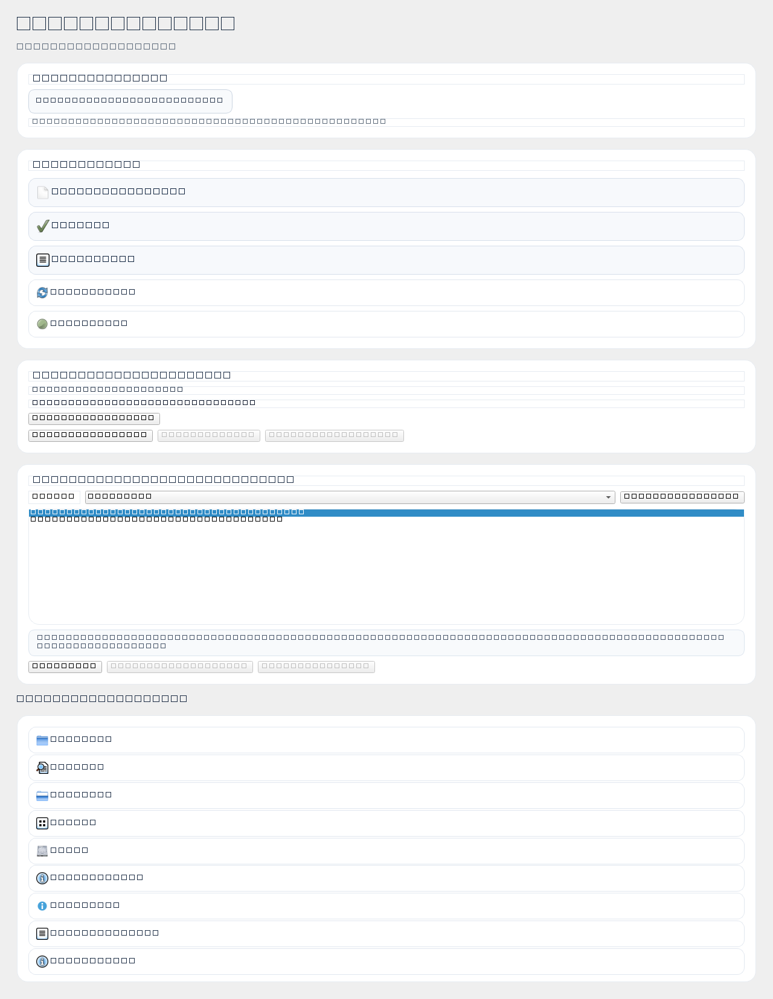
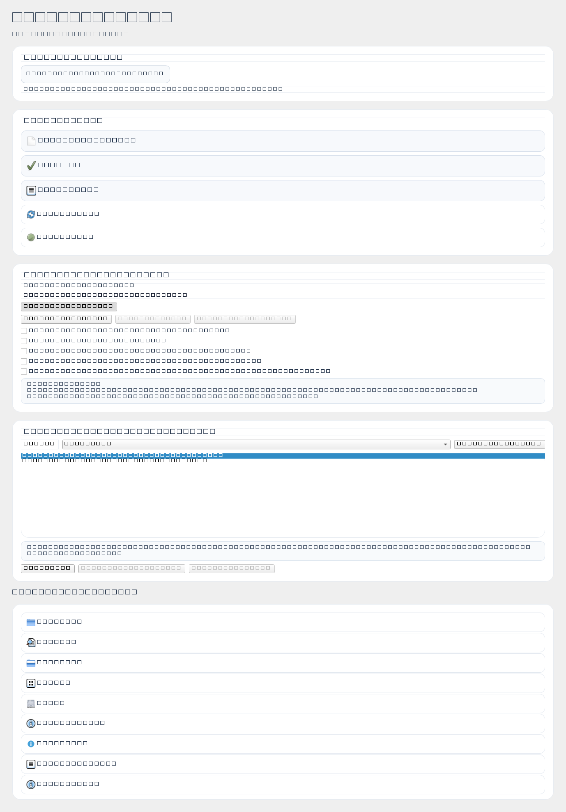
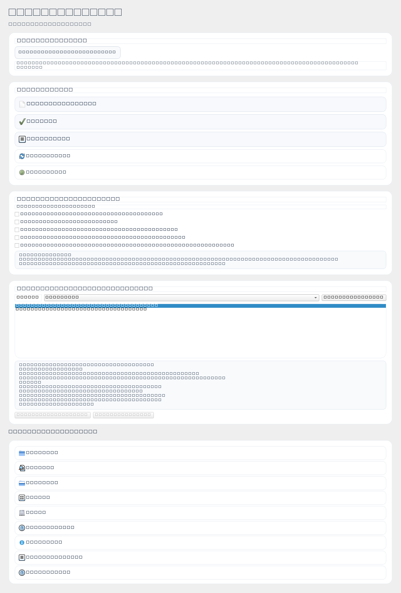
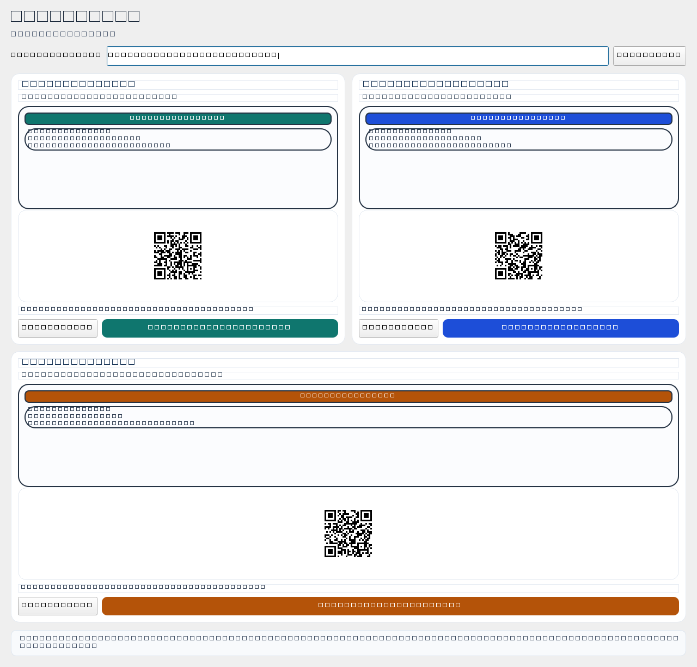

# Screeny Do Konsultacji

Folder: `docs/consultation_pack/screens/`

## Galeria (miniatury + linki)

| Nazwa | Miniatura | Pelny plik |
|---|---|---|
| `start_compact_ui.png` |  | [Otworz](screens/start_compact_ui.png) |
| `start_compact_ui_expanded.png` |  | [Otworz](screens/start_compact_ui_expanded.png) |
| `start_instruction_library.png` |  | [Otworz](screens/start_instruction_library.png) |
| `qr_telefon_measure_mobile.png` |  | [Otworz](screens/qr_telefon_measure_mobile.png) |

## Opis Uzycia

### 1) `start_compact_ui.png`
Kontekst: ekran Start po odchudzeniu.
Pytanie: czy nadal cos zabiera za duzo miejsca?

### 2) `start_compact_ui_expanded.png`
Kontekst: ten sam ekran z rozwinietym planem.
Pytanie: jak zorganizowac "Szczegoly", zeby nie dominowaly widoku?

### 3) `start_instruction_library.png`
Kontekst: sekcja instrukcji montaz/okucia.
Pytanie: jak pokazac wiecej tresci bez rozdmuchiwania layoutu?

### 4) `qr_telefon_measure_mobile.png`
Kontekst: przejscie na telefon i wejscie do pomiarow.
Pytanie: czy sciezka jest czytelna dla nowej osoby?
