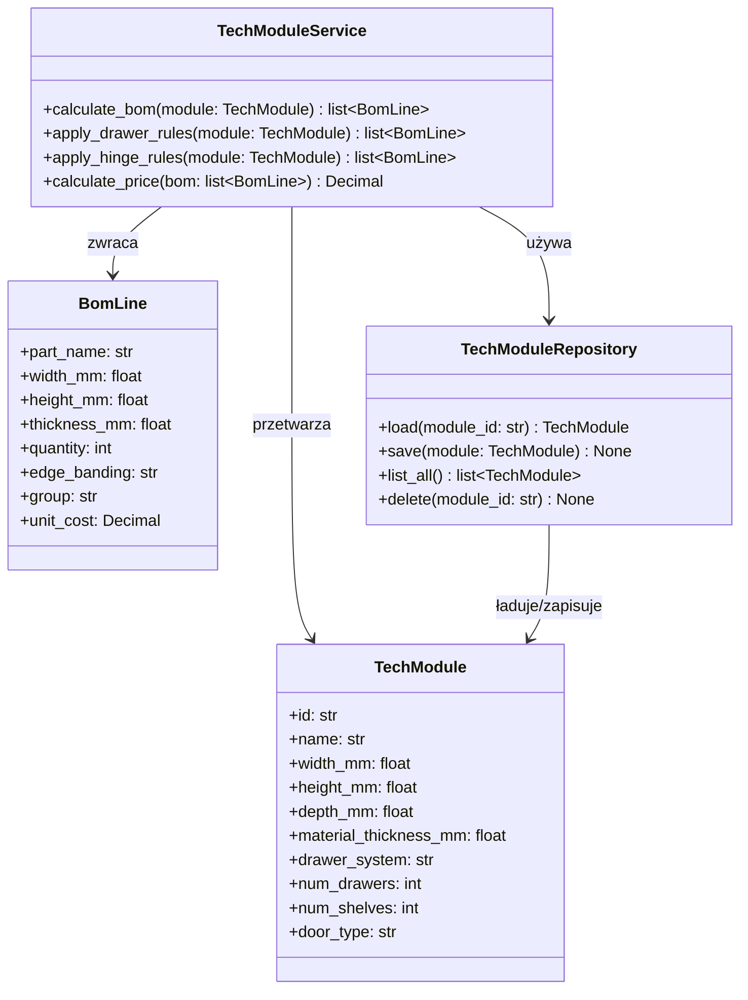

# MSI Tech Module — Diagram Architektury

## Pełny diagram warstw

```mermaid
graph TB
    subgraph GUI["Warstwa GUI (PyQt6)"]
        direction TB
        TAB_MOD["TabModul\ntab_modul.py"]
        TAB_TECH["TabTechModul\ntab_tech_modul.py"]
        BOM_BLOCK["BomBlock\nbom_block.py"]
        PARTS["PartsTableBlock\nparts_table_block.py"]
        VIEWS["ViewsCanvas\nviews_canvas.py"]
    end

    subgraph SERVICE["Warstwa Serwisów"]
        direction TB
        MSI_SVC["TechModuleService\nsrc/modules/msi_tech/service.py"]
        PRICING["ServicePricingPhase1\nservice_pricing_phase1.py"]
        EXPORT_3DC["ModuleExport3dcService\nmodule_export_3dc_service.py"]
        PDF_SVC["PdfService\npdf_service.py"]
        TG_SVC["TelegramHubService\ntelegram_hub_service.py"]
    end

    subgraph RULES["Silnik Reguł (core/rules) — czyste funkcje"]
        direction LR
        DRAW["drawers.py\nBlum Antaro / GTV Modern Box\ncalculate_drawer_parts()"]
        HINGE["hinges.py\nzawiasy 35mm / 26mm"]
        HW["hardware.py\nokucia systemowe"]
        LIFT["lifts.py\nmechanizmy górnounoszące"]
        DRILL["drilling_generator.py\notwory kołkowe"]
    end

    subgraph DOMAIN["Modele Domenowe"]
        direction TB
        MOD_MODEL["module_models.py\nModule, Part, EdgeBanding"]
        RESOLVED["resolved_module_models.py\nResolvedModule, ResolvedPart"]
        WALL_MOD["wall_models.py\nWall, Zone, WallPosition"]
        OPS["operations_models.py\nOperationsOrder, OperationsItem"]
    end

    subgraph REPO["Repozytorium / Storage"]
        direction TB
        MSI_REPO["TechModuleRepository\nrepository.py"]
        MOD_STORE["module_store_json.py"]
        REC_STORE["receptura_store_json.py"]
        MAT_STORE["material_store_json.py"]
        SQLITE["sqlite_db.py\norder_store_sqlite.py"]
    end

    subgraph DATA["Dane (data/)"]
        direction LR
        D_MOD["modules.json"]
        D_REC["receptura.json"]
        D_MAT["baza_materialu.json"]
        D_DB[("tech_modul.db\nSQLite")]
    end

    TAB_MOD --> MSI_SVC
    TAB_TECH --> TG_SVC
    BOM_BLOCK --> MSI_SVC
    PARTS --> MSI_SVC
    VIEWS --> RESOLVED

    MSI_SVC --> DRAW & HINGE & HW & LIFT & DRILL
    MSI_SVC --> PRICING
    MSI_SVC --> EXPORT_3DC
    MSI_SVC --> PDF_SVC
    MSI_SVC --> MOD_MODEL
    MSI_SVC --> RESOLVED
    MSI_SVC --> MSI_REPO

    MSI_REPO --> MOD_STORE & REC_STORE & MAT_STORE & SQLITE
    MOD_STORE --> D_MOD
    REC_STORE --> D_REC
    MAT_STORE --> D_MAT
    SQLITE --> D_DB
```

---

## Diagram zależności modułu MSI Tech

```mermaid
classDiagram
    class TechModuleService {
        +calculate_bom(module: TechModule) list~BomLine~
        +apply_drawer_rules(module: TechModule) list~BomLine~
        +apply_hinge_rules(module: TechModule) list~BomLine~
        +calculate_price(bom: list~BomLine~) Decimal
    }

    class TechModule {
        +id: str
        +name: str
        +width_mm: float
        +height_mm: float
        +depth_mm: float
        +material_thickness_mm: float
        +drawer_system: str
        +num_drawers: int
        +num_shelves: int
        +door_type: str
    }

    class BomLine {
        +part_name: str
        +width_mm: float
        +height_mm: float
        +thickness_mm: float
        +quantity: int
        +edge_banding: str
        +group: str
        +unit_cost: Decimal
    }

    class TechModuleRepository {
        +load(module_id: str) TechModule
        +save(module: TechModule) None
        +list_all() list~TechModule~
        +delete(module_id: str) None
    }

    TechModuleService --> TechModule : przetwarza
    TechModuleService --> BomLine : zwraca
    TechModuleService --> TechModuleRepository : używa
    TechModuleRepository --> TechModule : ładuje/zapisuje
```
