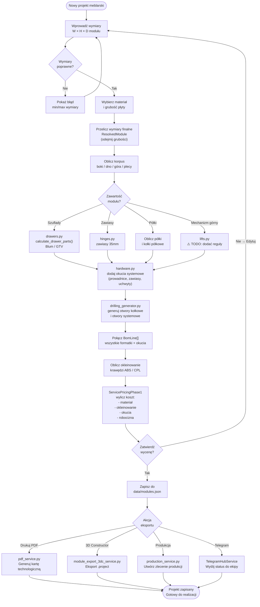
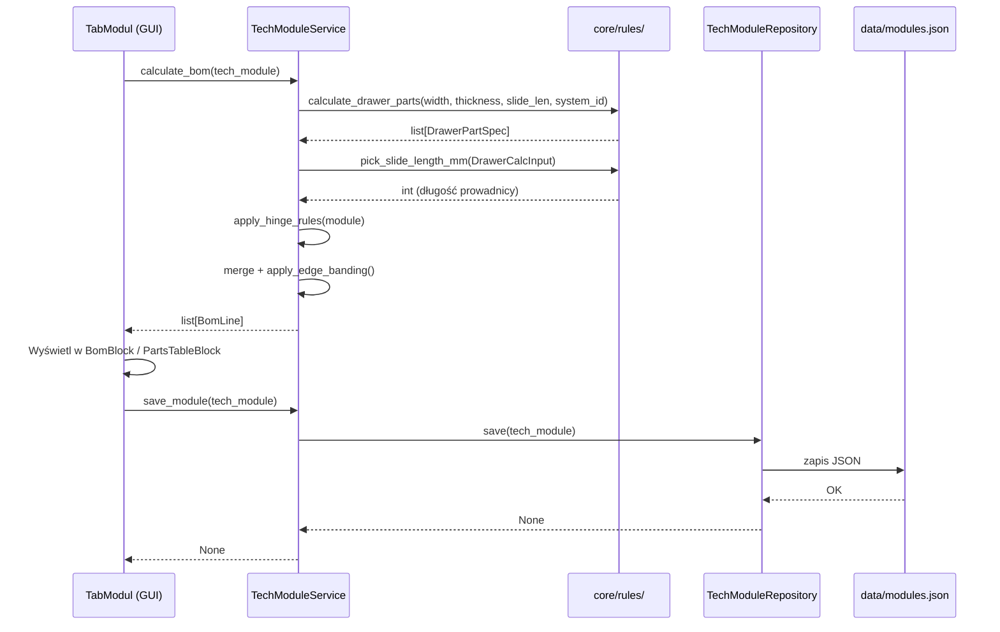
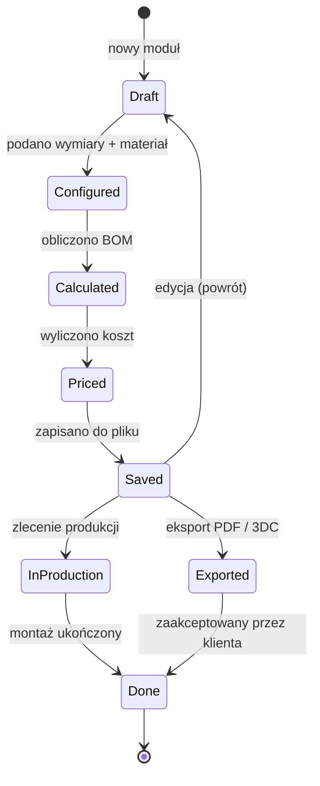

# MSI Tech Module — Flowchart Procesu

## Główny przepływ: od wymiaru do produkcji

```mermaid
flowchart TD
    START([Nowy projekt meblarski]) --> INPUT[Wprowadź wymiary\nW × H × D modułu]
    INPUT --> VALIDATE{Wymiary\npoprawne?}

    VALIDATE -- Nie --> ERROR[Pokaż błąd\nmin/max wymiary]
    ERROR --> INPUT

    VALIDATE -- Tak --> MAT[Wybierz materiał\ni grubość płyty]
    MAT --> RESOLVE["Przelicz wymiary finalne\nResolvedModule\n(odejmij grubości)"]

    RESOLVE --> BOM_CARCASS[Oblicz korpus\nboki / dno / góra / plecy]
    BOM_CARCASS --> RULES_GATE{Zawartość\nmodułu?}

    RULES_GATE -- Szuflady --> DRAW_RULE["drawers.py\ncalculate_drawer_parts()\nBlum / GTV"]
    RULES_GATE -- Zawiasy --> HINGE_RULE["hinges.py\nzawiasy 35mm"]
    RULES_GATE -- Półki --> SHELF_RULE["Oblicz półki\ni kołki półkowe"]
    RULES_GATE -- Mechanizm górny --> LIFT_RULE["lifts.py\n⚠️ TODO: dodać reguły"]

    DRAW_RULE & HINGE_RULE & SHELF_RULE & LIFT_RULE --> HARDWARE["hardware.py\ndodaj okucia systemowe\n(prowadnice, zawiasy, uchwyty)"]

    HARDWARE --> DRILL["drilling_generator.py\ngeneruj otwory kołkowe\ni otwory systemowe"]

    DRILL --> MERGE["Połącz BomLine[]\nwszystkie formatki + okucia"]

    MERGE --> EDGE["Oblicz okleinowanie\nkrawędzi ABS / CPL"]

    EDGE --> PRICE["ServicePricingPhase1\nwylicz koszt:\n- materiał\n- okleinowanie\n- okucia\n- robocizna"]

    PRICE --> REVIEW{Zatwierdź\nwycenę?}
    REVIEW -- Nie → Edytuj --> INPUT
    REVIEW -- Tak --> SAVE["Zapisz do\ndata/modules.json"]

    SAVE --> EXPORT_GATE{Akcja\neksportu}

    EXPORT_GATE -- Drukuj PDF --> PDF["pdf_service.py\nGeneruj kartę technologiczną"]
    EXPORT_GATE -- 3D Constructor --> E3DC["module_export_3dc_service.py\nEksport .project"]
    EXPORT_GATE -- Produkcja --> PROD["production_service.py\nUtwórz zlecenie produkcji"]
    EXPORT_GATE -- Telegram --> TG["TelegramHubService\nWyślij status do ekipy"]

    PDF & E3DC & PROD & TG --> DONE([Projekt zapisany\nGotowy do realizacji])
```

---

## Przepływ danych przez warstwy

```mermaid
sequenceDiagram
    participant GUI as TabModul (GUI)
    participant SVC as TechModuleService
    participant RULES as core/rules/
    participant REPO as TechModuleRepository
    participant DATA as data/modules.json

    GUI->>SVC: calculate_bom(tech_module)
    SVC->>RULES: calculate_drawer_parts(width, thickness, slide_len, system_id)
    RULES-->>SVC: list[DrawerPartSpec]
    SVC->>RULES: pick_slide_length_mm(DrawerCalcInput)
    RULES-->>SVC: int (długość prowadnicy)
    SVC->>SVC: apply_hinge_rules(module)
    SVC->>SVC: merge + apply_edge_banding()
    SVC-->>GUI: list[BomLine]
    GUI->>GUI: Wyświetl w BomBlock / PartsTableBlock

    GUI->>SVC: save_module(tech_module)
    SVC->>REPO: save(tech_module)
    REPO->>DATA: zapis JSON
    DATA-->>REPO: OK
    REPO-->>SVC: None
    SVC-->>GUI: None
```

---

## Stany modułu

```mermaid
stateDiagram-v2
    [*] --> Draft : nowy moduł

    Draft --> Configured : podano wymiary + materiał
    Configured --> Calculated : obliczono BOM
    Calculated --> Priced : wyliczono koszt
    Priced --> Saved : zapisano do pliku

    Saved --> Exported : eksport PDF / 3DC
    Saved --> InProduction : zlecenie produkcji
    Saved --> Draft : edycja (powrót)

    InProduction --> Done : montaż ukończony
    Exported --> Done : zaakceptowany przez klienta

    Done --> [*]
```
