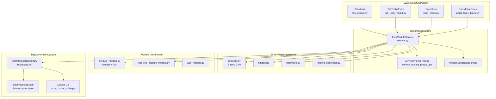

# MSI Tech Module — Dokumentacja Architektury

> Moduł techniczny systemu ERP dla firmy meblarskiej.
> Odpowiada za obliczenia BOM, reguły okuć, konfigurację modułów i planowanie produkcji.

---

## 1. Struktura Folderów

```
TECH_modul/
├── src/
│   ├── modules/
│   │   └── msi_tech/                   ← NOWY moduł MSI Tech
│   │       ├── __init__.py
│   │       ├── config.py               ← stałe i konfiguracja modułu
│   │       ├── models.py               ← dataklasy domenowe (TechModule, BomLine)
│   │       ├── repository.py           ← dostęp do danych (JSON/SQLite)
│   │       └── service.py              ← logika biznesowa (obliczenia BOM, okucia)
│   │
│   ├── core/
│   │   ├── rules/                      ← reguły produkcyjne (istniejące)
│   │   │   ├── drawers.py              ← szuflady (Blum, GTV)
│   │   │   ├── hinges.py               ← zawiasy
│   │   │   ├── hardware.py             ← okucia
│   │   │   ├── lifts.py                ← mechanizmy górnounoszące
│   │   │   └── drilling_generator.py   ← otwory pod kołki
│   │   └── operations_models.py        ← modele operacji produkcyjnych
│   │
│   ├── domain/
│   │   ├── module_models.py            ← model meblowy (Module, Part)
│   │   ├── resolved_module_models.py   ← przeliczone rozmiary finalne
│   │   └── wall_models.py              ← model ściany (Wall, Zone)
│   │
│   ├── tabs/
│   │   ├── modul/                      ← zakładka projektowania modułu (GUI)
│   │   │   ├── tab_modul.py
│   │   │   ├── bom_block.py            ← widok listy materiałów
│   │   │   └── parts_table_block.py    ← tabela formatek
│   │   └── tech_modul/                 ← zakładka TECH (screeny, Telegram Hub)
│   │       └── tab_tech_modul.py
│   │
│   └── services/
│       ├── service_pricing_phase1.py   ← wycena usług z parametrów tech
│       └── module_export_3dc_service.py← eksport do 3D Constructor
│
├── data/
│   ├── modules.json                    ← baza modułów (szablony)
│   ├── receptura.json                  ← receptury (składniki / okucia)
│   └── baza_materialu.json             ← cennik materiałów
│
└── docs/
    └── msi_tech_module/
        ├── README.md                   ← ten plik
        ├── ARCHITECTURE.md             ← diagram Mermaid
        └── FLOWCHART.md                ← flowchart procesu
```

---

## 2. Główne Komponenty

| Komponent | Plik | Odpowiedzialność |
|-----------|------|-----------------|
| **TechModuleConfig** | `modules/msi_tech/config.py` | Stałe: grubości płyt, minimalne wymiary, domyślny system szuflad |
| **TechModuleModel** | `modules/msi_tech/models.py` | Dataklasy: `TechModule`, `BomLine`, `PartSpec` |
| **TechModuleRepository** | `modules/msi_tech/repository.py` | Odczyt/zapis danych z `data/modules.json` i SQLite |
| **TechModuleService** | `modules/msi_tech/service.py` | Obliczenia BOM, reguły szuflad, zawiasów, kołków |
| **Rules (core/rules/)** | `drawers.py`, `hinges.py`, etc. | Silnik reguł produkcyjnych — czyste funkcje |
| **TabModul (GUI)** | `tabs/modul/tab_modul.py` | Interfejs PyQt6 — projektowanie modułu |
| **TabTechModul (GUI)** | `tabs/tech_modul/tab_tech_modul.py` | Zakładka TECH: screeny + Telegram Hub |
| **ServicePricingPhase1** | `services/service_pricing_phase1.py` | Wycena usług na podstawie wymiarów technicznych |

---

## 3. Diagram Architektury (Mermaid)

Plik: [ARCHITECTURE.md](./ARCHITECTURE.md)



---

## 4. Flowchart Procesu

Plik: [FLOWCHART.md](./FLOWCHART.md)

```mermaid
flowchart TD
    START([Nowy projekt meblarski]) --> INPUT[Wprowadź wymiary\nW × H × D modułu]
    INPUT --> VALIDATE{Wymiary\npoprawne?}
    VALIDATE -- Nie --> ERROR[Pokaż błąd\nmin/max wymiary]
    ERROR --> INPUT
    VALIDATE -- Tak --> RESOLVE[Przelicz wymiary finalne\nresolved_module_models.py]
    RESOLVE --> BOM[Oblicz BOM\nlistę formatek + materiałów]
    BOM --> RULES{Zastosuj reguły}
    RULES --> DR[Szuflady\ndrawers.py]
    RULES --> HG[Zawiasy\nhinges.py]
    RULES --> HW[Okucia\nhardware.py]
    RULES --> KL[Kołki\ndrilling_generator.py]
    DR & HG & HW & KL --> MERGE[Połącz wszystkie\nczęści w BomLine[]]
    MERGE --> PRICE[Wylicz koszt\nServicePricingPhase1]
    PRICE --> SAVE[Zapisz do\ndata/modules.json]
    SAVE --> EXPORT{Eksport?}
    EXPORT -- PDF --> PDF[Generuj PDF\npdf_service.py]
    EXPORT -- 3DC --> E3DC[Eksport 3D Constructor\nmodule_export_3dc_service.py]
    EXPORT -- Telegram --> TG[Wyślij przez\nTelegram Hub]
    PDF & E3DC & TG --> DONE([Gotowe])
```

---

## 5. Uruchomienie

```powershell
# Aplikacja desktopowa
.\.venv\Scripts\python.exe .\src\app\main.py

# Tryb serwer (kiosk/tablet)
.\.venv\Scripts\python.exe .\src\app\main.py --server --server-port 8000
```

---

## 6. Zmienne środowiskowe

| Zmienna | Domyślna wartość | Opis |
|---------|-----------------|------|
| `TECH_MODUL_DATA_DIR` | `<repo>/data` | Katalog z plikami JSON |
| `TECH_MODUL_SAFE_MODE` | `0` | `1` = tryb tylko do odczytu |

---

## 7. TODO — miejsca do uzupełnienia

- [ ] `service.py` → `calculate_bom()` — dodać obsługę receptur (receptura.json)
- [ ] `service.py` → `apply_lift_rules()` — reguły mechanizmów górnounoszących (lifts.py)
- [ ] `repository.py` → migracja z JSON do SQLite (wzorzec: `order_store_sqlite.py`)
- [ ] `models.py` → pole `cost_breakdown` w `BomLine` (aktualnie brak wyceny per-formatka)
- [ ] `config.py` → dodać profile materiałowe (HDF / MDF / wiórowa) zamiast hardcoded `t=18.0`
- [ ] Testy jednostkowe dla `TechModuleService` w `src/tests/`
